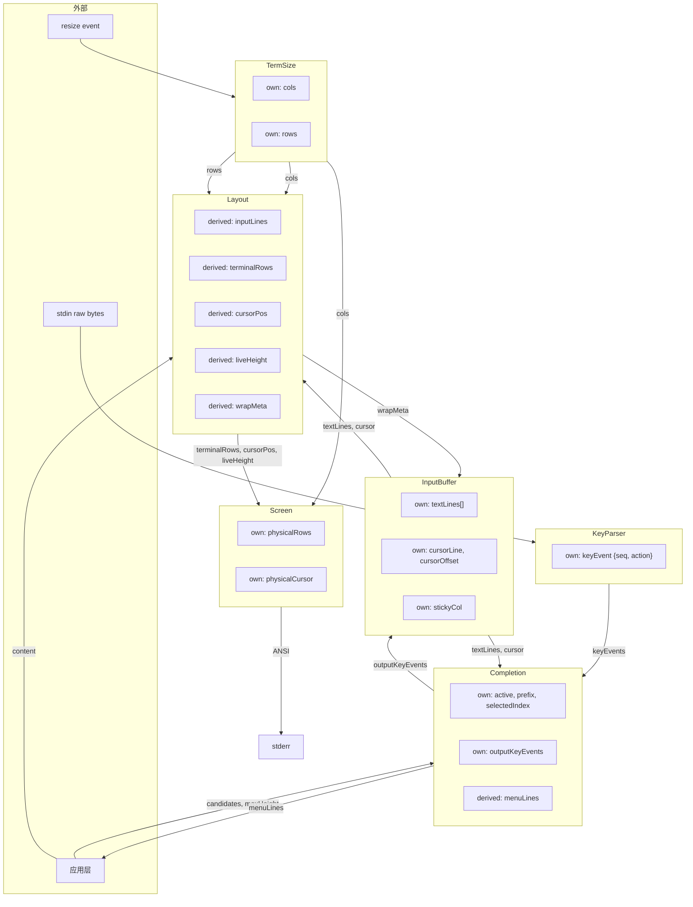

# terminal-renderer 设计规格

基于 ownflow 的终端混合渲染引擎。

## 核心原则

1. **终端永远不替我折行** — 写入的每行宽度 ≤ cols
2. **物理模型是 own 状态** — Screen 精确知道终端上有什么
3. **diff 在终端行粒度** — `physicalRows[i] !== terminalRows[i]` 纯字符串比较
4. **resize 不需要特殊逻辑** — cols 变 → terminalRows 全变 → diff 自然全量重写
5. **live-height 声明式** — `min(termRows, contentHeight, maxHeight)`
6. **光标绑定文本位置** — own 状态是 TextPosition，屏幕位置全部 derived
7. **单一写入者** — 每个 own 只有一个模块写入

## 数据管线

```
Text（原始字符串，own by InputBuffer）
  → TextLine（按 \n 拆分）
    → InputLine（绑定 cols 切分，derived）
      → InputArea（绑定 liveHeight 裁剪视口，derived）
        → TerminalRow（Screen 消费 + diff + ANSI 输出）
```

## 数据流图



## 模块规格

### TermSize
- **own**: `cols: number`, `rows: number`
- **watch**: `resizeEvent: { seq, cols, rows }`
- 纯数据持有

### KeyParser
- **own**: `keyEvents: { seq, actions: Action[] }`
- **watch**: `rawInput: { seq, data: string }`
- 解析 raw bytes → Action（char/arrow/submit/abort/paste/tab）
- 处理 bracketed paste（跨 chunk 状态机）

### Completion
- **watch**: `textLines`, `cursorLine`, `cursorOffset`（检测 `@` 触发）
- **watch**: `keyEvents`（拦截 Tab/→/Esc）
- **watch**: `candidates: string[]`
- **own**: `active`, `prefix`, `selectedIndex`, `outputKeyEvents`
- **derived**: `filteredCandidates`, `menuLines`
- 激活时：Tab 切换、→ 接受（发射 backspace+paste 到 outputKeyEvents）、其余透传
- 非激活时：全部透传

### InputBuffer
- **watch**: `keyEvents`（from Completion.outputKeyEvents）
- **watch**: `wrapMeta`（from Layout，用于终端行级光标移动）
- **own**: `textLines[]`, `cursorLine`, `cursorOffset`, `stickyCol`
- 光标 own 状态是 TextPosition（文本行 + 字符间隙偏移）
- Up/Down 通过 wrapMeta 在 InputLine 级别移动，反算回 TextPosition
- 左右/插入/删除重置 stickyCol

### Layout
- **watch**: `cols`, `rows`, `textLines`, `cursorLine`, `cursorOffset`, `maxHeight`
- **derived**:
  - `inputLines`: textLines 按 cols 切分后的 InputLine[]
  - `wrapMeta`: 每个文本行的折行 span 信息（供 InputBuffer 光标移动）
  - `liveHeight`: min(rows, inputLines.length, maxHeight)
  - `scrollOffset`: 保证光标在视口内
  - `terminalRows`: inputLines[scrollOffset..scrollOffset+liveHeight] 的文本
  - `cursorPos`: 光标在视口内的 {row, col}
- 纯计算，无 own，无副作用

### Screen
- **watch**: `terminalRows`, `cursorPos`, `liveHeight`, `cols`, `freezeSeq`
- **own**: `physicalRows[]`, `physicalCursor`
- **on terminalRows 变化**:
  1. 用当前 cols 计算 physicalRows 实际占多少物理行（处理 resize reflow）
  2. cursor-up 到 live zone 顶部
  3. clearDown
  4. 逐行写入新 terminalRows（或 diff 优化：跳过未变行）
  5. 定位光标到 cursorPos
  6. 更新 physicalRows/physicalCursor
- **on cursorPos 变化**（内容未变时）: 仅重定位光标
- **on freezeSeq 变化**: 光标移到 live zone 末尾 → 换行 → 重置 physicalRows

## 光标移动模型

```
光标 own 状态: TextPosition { line: number, offset: number }

Up 键按下:
  1. TextPosition → InputLinePosition (通过 wrapMeta 查找 offset 所在 inputLine)
  2. inputLine - 1（上移一个输入行）
  3. 用 stickyCol 在目标 inputLine 中反算 → 新的 TextPosition
  4. 写回 own 状态

stickyCol:
  - 首次垂直移动时记录当前可见列
  - 连续垂直移动保持
  - 任何非垂直操作重置为 null
```

## live-height

```
liveHeight = min(terminalRows, contentRequiredHeight, maxHeight)
```

- Screen 精确管理 liveHeight 行
- cursor-up 计算考虑 reflow（resize 后旧行可能占更多物理行）
- freeze = 释放 live zone 为 scrollback，physicalRows 清空

## resize 处理

```
cols 变化
  → inputLines 全部重新切分（derived 重算）
  → terminalRows 全部变化
  → Screen diff 发现全不同 → 全量重写
  → 同时：cursor-up 需要考虑旧 physicalRows 在新 cols 下的 reflow
    physicalRowCount = sum(ceil(visibleWidth(row) / newCols))
```

## 补全菜单

```
用户输入 '@' (行首或空白后)
  → Completion 激活，prefix = ""
  → menuLines 产出候选列表
  → 应用层将 menuLines 插入 cursorLine+1 处
  → Layout 渲染合成内容
  → Screen 渲染

Tab → selectedIndex 循环
→ → 接受：删除 @prefix，插入完整候选文本
继续输入 → prefix 更新 → filteredCandidates 过滤
光标离开 @ 区域 → Completion 关闭
```

## 依赖

- `ownflow` — 响应式模块架构
- `@vue/reactivity` — reactive primitives (ownflow peer dep)
- `string-width` — CJK/emoji 可见宽度计算
- `picocolors` — 终端颜色（可选）
